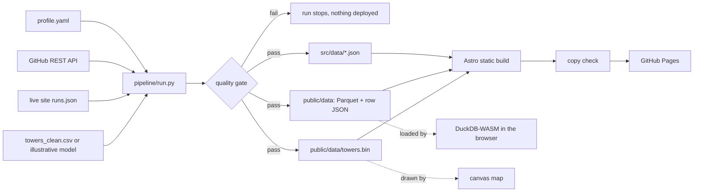

# ahmdgameel.github.io

The portfolio of **Ahmed Gameel**, Data Engineer. Live at **https://ahmdgameel.github.io**.

It reads in 30 seconds for a recruiter and holds up for an hour with an engineer. A switch in the
header changes the depth of the whole page:

- **Recruiter view** (default): role, current company, education, certificate and resume in the
  first screen, plain language everywhere.
- **Engineer view**: design decisions, metric lineage, the evidence matrix, the quality gate, the
  run history and a SQL console over the published tables.

## What makes it different

- **A live map of Egypt drawn by 10,192 cell towers.** The hero replays my Tower Health Stream
  project in the browser: a port of `tower_simulator.py` and of the Flink SQL rules in
  `anomaly_detection.py`, running at the real rate of 2,038 events per second, with 10 minute
  tumbling windows replayed 60x.
- **Every number has lineage.** Each metric links to the file in the project repo it came from and
  says how it was measured. The build fails if a featured metric has no source.
- **Skills ranked by evidence, not by stars.** Each skill sits in the strongest column it can prove:
  used at work, shipped in a public repo, or trained on.
- **The site is a pipeline.** A daily GitHub Action extracts, transforms, runs blocking quality
  checks and only then publishes. The status board judges freshness against a 26 hour SLA in the
  visitor's browser, so a missed run is visible.
- **Command palette** with Ctrl K, a night and a day theme, and a print stylesheet for recruiters
  who save the page as PDF.

## Architecture



The run history needs no database: each deploy publishes `/data/runs.json`, and the next run reads it
back from the live site before appending its own row.

## The tower layer

Drop the cleaned OpenCelliD export from the tower-health-stream repo (`data/towers_clean.csv`, the
output of `simulator/data_cleaner.py`) into `pipeline/sources/towers_clean.csv` and run the pipeline.
The map then shows the real towers, the `towers` table appears in the SQL console and the footer
switches to OpenCelliD attribution (CC BY-SA 4.0). Until then the map uses an illustrative model
of where Egyptians live with the real operator split, and says so on screen.

## Stack

- **Site:** Astro, TypeScript, plain CSS, Canvas and SVG. No UI framework.
- **Fonts:** Archivo (variable width) for display, Geist for text, Martian Mono for data.
- **SQL engine:** `@duckdb/duckdb-wasm`, fetched only when the console scrolls into view in the
  engineer view. Tables load from row JSON, which DuckDB-WASM reads natively, so no extension is
  downloaded at runtime.
- **Pipeline:** Python and DuckDB, writing ZSTD compressed Parquet.
- **CI/CD:** GitHub Actions to GitHub Pages, every push and every morning at 06:00 UTC, with a
  keepalive so GitHub never disables the schedule.

## Edit the content

Everything about me lives in [`pipeline/sources/profile.yaml`](pipeline/sources/profile.yaml).
Change it, push, and the pipeline does the rest.

## Run locally

```bash
pip install -r pipeline/requirements.txt
npm install
npm run pipeline   # extract, validate, load
npm run dev        # http://localhost:4321
```

`python3 pipeline/run.py --offline` uses the cached GitHub snapshot when there is no network.

The share card and app icons are rendered from the built site:

```bash
npm run build && npx astro preview &
node pipeline/tools/og.mjs   # needs Playwright
```
