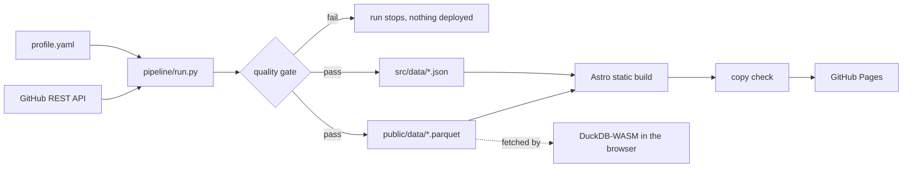

# ahmdgameel.github.io

The portfolio of **Ahmed Gameel**, Data Engineer. Live at **https://ahmdgameel.github.io**.

A one page portfolio built for quick reading: who I am, where I work, what I built, and how to
reach me. A few details make it my own:

- The name at the top is drawn as a dot matrix, written column by column like rows arriving in a table.
- Each project shows a live diagram of how its data flows.
- A small demo at the end loads my profile as Parquet files and lets you query it with DuckDB in the browser.
- The site is rebuilt every day by a short Python job that pulls my latest GitHub data.

## Architecture



A GitHub Actions workflow runs on every push and every morning at 06:00 UTC.

The job validates the source data (unique ids, valid date ranges, diagram edges that resolve)
before anything is published.

## Stack

- **Site:** Astro, TypeScript, plain CSS, Canvas and SVG. No UI framework.
- **SQL engine:** `@duckdb/duckdb-wasm`, lazy loaded when the visitor reaches the console.
- **Pipeline:** Python and DuckDB, writing ZSTD compressed Parquet.
- **CI/CD:** GitHub Actions to GitHub Pages.

## Asset tools

`pipeline/tools/` holds one off scripts: `icons.py` (dot matrix AG favicon) and `og.py` (share card).

## Edit the content

Everything about me lives in [`pipeline/sources/profile.yaml`](pipeline/sources/profile.yaml).
Change it, push, and the pipeline does the rest.

## Run locally

```bash
pip install -r pipeline/requirements.txt
npm install
npm run pipeline   # extract, validate, load
npm run dev        # http://localhost:4321
```

`python3 pipeline/run.py --offline` uses the cached GitHub snapshot when there is no network.
