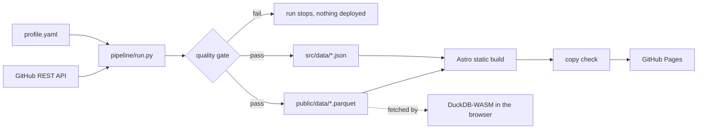

# ahmdgameel.github.io

The portfolio of **Ahmed Gameel**, Data Engineer. Live at **https://ahmdgameel.github.io**.

This site is not a template. It is a small data platform, and every section is a stage of the
pipeline that builds it.

| Stage | Section | What happens |
|---|---|---|
| `source` | Intro | Name, role and proof numbers in the first seconds. The name is a dot matrix written by a stream of records, column by column, and it reacts to the cursor. |
| `bronze` | About | Who I am, how I work, and my toolbox with hands on depth. |
| `silver` | Experience | An Airflow style grid view (one square per month) above a plain list of every role. |
| `gold` | Projects | Case studies: problem, what I built, result, SLA numbers, and a live diagram of how the data flows. |
| `serving` | Query | DuckDB compiled to WebAssembly runs real SQL over the Parquet files in your browser. |
| `sink` | Contact | A Kafka producer form that publishes to the `hire-ahmed` topic (your mail client is the broker). |
| `observability` | Footer | Real stats from the pipeline run that built the page. |

## Architecture



A GitHub Actions workflow runs on every push and every morning at 06:00 UTC.

**Quality checks** (the run fails if any of them fails): no em dashes, English only, unique ids,
valid date ranges, a single current role, topology edges that resolve, and skill levels in range.
A second check scans the built site for the same copy rules.

## Stack

- **Site:** Astro, TypeScript, plain CSS, Canvas and SVG. No UI framework.
- **SQL engine:** `@duckdb/duckdb-wasm`, lazy loaded when the visitor reaches the console.
- **Pipeline:** Python and DuckDB, writing ZSTD compressed Parquet.
- **CI/CD:** GitHub Actions to GitHub Pages.

## Asset tools

`pipeline/tools/` holds one off scripts: `icons.py` (dot matrix AG favicon), `og.py` (share card)
and `portrait.py` (background removal and white outline, needs `rembg`).

## Edit the content

Everything about me lives in [`pipeline/sources/profile.yaml`](pipeline/sources/profile.yaml).
Change it, push, and the pipeline does the rest.

## Run locally

```bash
pip install -r pipeline/requirements.txt
npm install
npm run pipeline   # extract, validate, load
npm run dev        # http://localhost:4321
```

`python3 pipeline/run.py --offline` uses the cached GitHub snapshot when there is no network.
