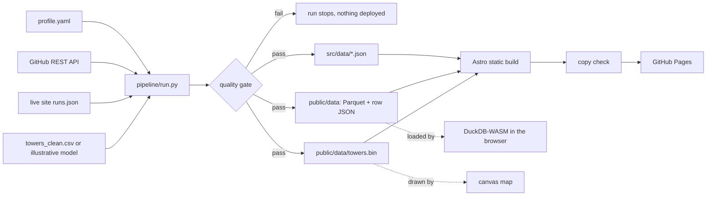

# ahmdgameel.github.io

The portfolio of **Ahmed Gameel**, Data Engineer. Live at **https://ahmdgameel.github.io**.

Built for the person deciding whether to reach out. The layout follows how recruiters actually read
a portfolio: they decide in 15 to 30 seconds, so the name, role, current job, location, availability
and the two actions that matter (email, resume) stay visible while the page scrolls.

## What is on the page

- **Identity column** (sticky on desktop): name, role, a two line pitch, availability, Email and Resume
  buttons, quick facts (current role, location with local time, degree, certificate) and section links.
  On mobile a slim bar keeps Email and Resume one tap away.
- **Experience**: work and training programs listed separately, with dates and stack.
- **Projects**: three case studies with equal weight (streaming, batch, warehouse). Each case study page
  explains the problem, the design decisions and where every number comes from, linked to the file in
  the project repo.
- **Skills**: grouped by area, with education and certificates.
- **Contact**: email, WhatsApp, LinkedIn, resume and a short form.

Engineering depth lives one click away: the Tower Health Stream case study replays the project live on a
map of the 10,192 real towers, and [/platform/](https://ahmdgameel.github.io/platform/) shows how the site
itself is built, with its quality checks, run history and a SQL console over the published tables.

## Architecture



The run history needs no database: each deploy publishes `/data/runs.json`, and the next run reads it
back from the live site before appending its own row.

## The tower layer

`pipeline/sources/towers_clean.csv` holds the 10,192 Egyptian towers (OpenCelliD, MCC 602), cleaned by
`simulator/data_cleaner.py` in the tower-health-stream repo. Tower locations are from
[OpenCelliD](https://opencellid.org), licensed CC BY-SA 4.0.

`pipeline/sources/tower_health_stream/` holds the CSV exports of two dbt models from the same project,
`operator_performance` and `regional_risk_index`. They power the batch results on the case study page
and are queryable in the console.

On every build the quality gate checks that:

- every tower sits inside Egypt's bounding box and belongs to a known operator,
- the natural key `(radio, operator, area, cell)` is unique (cell ids alone repeat across areas),
- the tower count claimed on the site equals the rows in the data,
- the dbt outputs reconcile with the raw towers, per operator and per area.

Without the CSV the map falls back to an illustrative model and says so on screen.

## Stack

- **Site:** Astro, TypeScript, plain CSS, Canvas and SVG. No UI framework. Light by default, dark mode
  follows the system.
- **Fonts:** Geist and Geist Mono.
- **SQL engine:** `@duckdb/duckdb-wasm` on the platform page, fetched only when the console scrolls
  into view. Tables load from row JSON, which DuckDB-WASM reads natively, so no extension is
  downloaded at runtime.
- **Pipeline:** Python and DuckDB, writing ZSTD compressed Parquet.
- **CI/CD:** GitHub Actions to GitHub Pages, every push and every morning at 06:00 UTC, with a
  keepalive so GitHub never disables the schedule.

## Edit the content

Everything about me lives in [`pipeline/sources/profile.yaml`](pipeline/sources/profile.yaml).
Change it, push, and the pipeline does the rest.

## Run locally

```bash
pip install -r pipeline/requirements.txt
npm install
npm run pipeline   # extract, validate, load
npm run dev        # http://localhost:4321
```

`python3 pipeline/run.py --offline` uses the cached GitHub snapshot when there is no network.

The share card and app icons are rendered from the built site:

```bash
npm run build && npx astro preview &
node pipeline/tools/og.mjs   # needs Playwright
```
